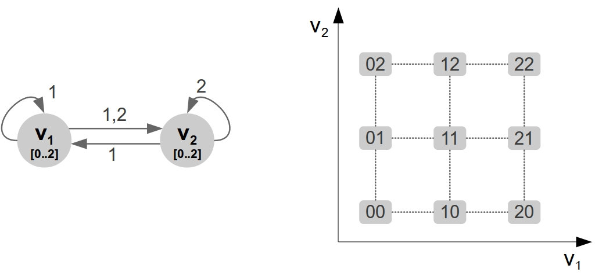

Running Example Summary Page
****************************
The running example is introduced step by step in :doc:`Appendix A <appendixA>`. This page is a summary that may be opened in a new window while reading :doc:`Appendix A<appendixA>` or :doc:`Appendix B<appendixB>`.
The :ref:`regulatory graph <appendixA_reg_graphs>` and :ref:`state space <appendixA_state_space>` of the running example are:

Formally, the regulatory graph consists of :math:`\mathcal R=(V,E,\rho,\theta)`, where

.. math::
	
	\begin{array}{l}
		V=\{v_1,v_2\}\\
		E=\{v_1v_1,v_1v_2,v_2v_1,v_2v_2\}\\
		\theta(v_1v_1)=(1)\\
		\theta(v_1v_2)=(1,2)\\
		\theta(v_2v_1)=(1)\\
		\theta(v_2v_2)=(2)\\
		\rho(v_1)=2\\
		\rho(v_2)=2
	\end{array}.

Component :math:`v_1` has 4 :ref:`regulatory contexts <appendixA_regulatory_context>` and component :math:`v_2` has 6:

.. math::
	
	C_1=\{(0,0),(0,1),(1,0),(1,1)\},\;\;C_2=\{(0,0),(0,1),(1,0),(1,1),(2,0),(2,1)\}.

The state space partition by the contexts are:

	.. image:: images/appendix_A_07.jpg
		:scale: 50%
		:align: center

The running example has 10 :ref:`kinetic parameters <appendixA_kinetic_parameters>`:

.. math::

	K_{\mathcal R}=\{K_1^{00},K_1^{01},K_1^{10},K_1^{11},K_2^{00},K_2^{01},K_2^{10},K_2^{11},K_2^{20},K_2^{21}\}

